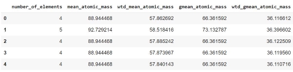
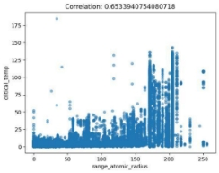
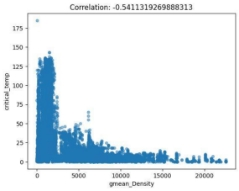
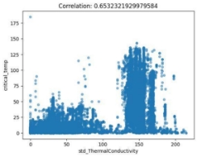
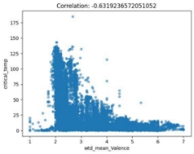
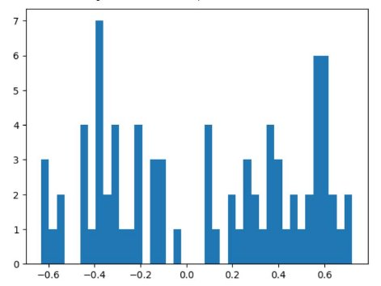
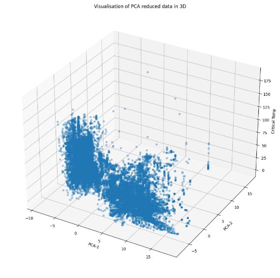
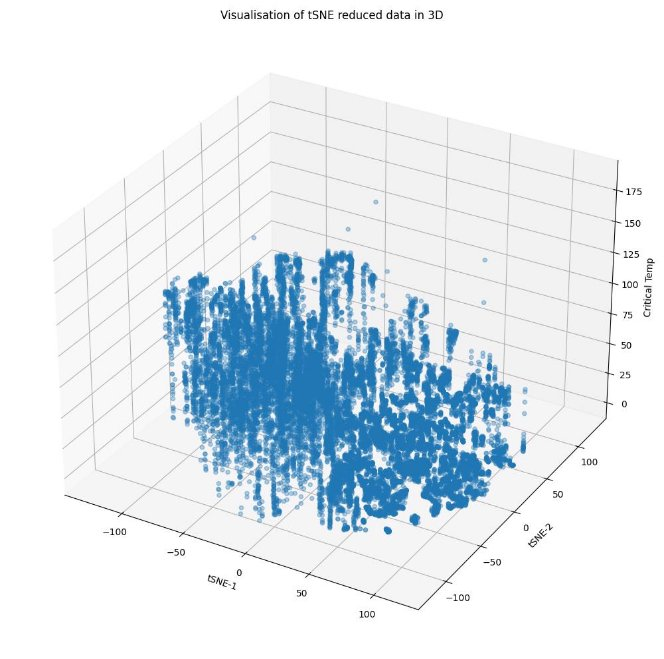
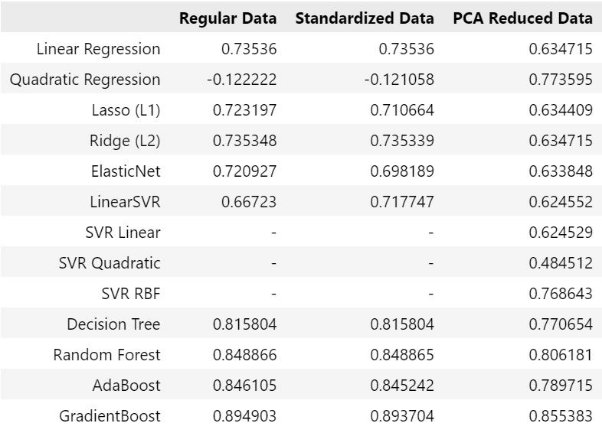
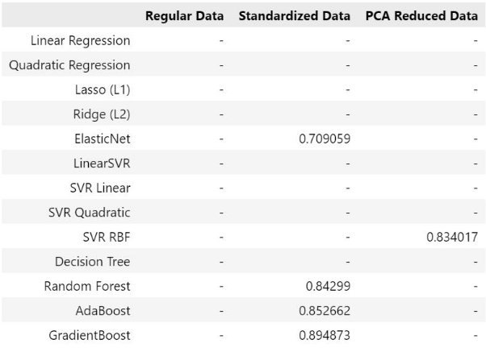



**MachineLearning**

**Course Project Report (Regression)**

**(Final Report, TeamNo: 01)![ref1]**

**Title of the project:** Superconductivity Data

**Author 1 :** SarangGalada, <sarang.g-25@scds.saiuniversity.edu.in>

**Author 2 :** R Sai PranavAadhitya, <saipranavaadhitya.r-25@scds.saiuniversity.edu.in>

![ref1]

1. **Introduction**

Superconductivity is theproperty of certain materials to exhibit zero electrical resistance, ie. ability to conduct direct current electricity without energy loss, when cooled below their critical temperature. Due to its unique advantages, a lot of research has been directed towards superconductivity and its applications. Despite that, the relationship between Critical Temperature (below which the material behaves as a superconductor) and the material’s chemical properties is poorly understood. This has propelled efforts to use Machine Learning techniques to model critical temperature and understand its relationship with the material’s chemical properties.

- ProblemStatement:

Predicting the Critical Temperature of the Superconductor compounds based on the values of their various chemical properties.

2. **Dataset and Features**
- Details of the dataset:

This project makes use of the Superconductivity dataset from University of California, Irvine’s Machine Learning Repository, sourced from Dr. Kam Hamidieh. The dataset consists of 21,263 rows and 82 columns. The rows represent different superconductor compounds(eg. La2CuO4), while the columns depict various statistical measures of their chemical properties(eg. mean Atomic Mass, standard deviation of Thermal Conductivity, range of Heat of Fusion and so on). Of these 82 columns, 81 are the input features for our learning model, with the 82nd column critical\_temp (Critical Temperature) being the target variable we wish to predict.

- Exploratory Data Analysis:

As mentioned earlier, the dataset contains 21,263 rows and 82 columns.

Peak into the first 5 rows of the dataset

Majority of the columns are of type Float64, with the exception of two (number\_of\_elements, range\_Valence), which are of type int64 and hence take discrete values. The dataset doesn’t contain any missing values, although it was found to contain 66 duplicate rows, which had to be dropped as part of data cleaning.

To understand the relationship between the features of the dataset and the target variable critical\_temp, we make use of scatterplots and correlation matrices. Samples of some scatterplots are shown below.

 

  As can be seen, we do not observe distinct linear patterns emerge between the features and our target variable critical\_temp, but still do observe an increasing or decreasing trend in the case of some features. The values in the correlation matrix support this fact, as those features show a reasonably high absolute value of correlation with critical\_temp, indicating some amount of linear dependence.

Here’s a histogram showing distribution of correlation values of all the features with target variable critical\_temp.

- Dimensionality Reduction & Data Visualisation:

We use dimensionality reduction techniques to reduce the number of features in the data from 81 to 2, so that the point cloud can be visualized in 3D when the features are plotted against the target variable critical\_temp. In this project, we use Principal Component Analysis and t-Distributed Stochastic Neighbour Embedding.

- Principal Component Analysis (PCA):

Reduces the features of the data by finding their directions of maximum variance and projecting the data along those directions, thus preserving information of the original attributes and also reducing the size of the dataset for better computations and visualizations.

- t-Distributed Stochastic Neighbour Embedding(t-SNE): tSNE is a nonlinear dimensionality reduction technique that uses similarity between data points to construct probability distributions and replicates them in lower dimensions. Thus, it reduces the dimensionality of the data while preserving the structure of each feature as much as possible. It is a Manifold approach.

3. **Methods**
1. **Baseline - Linear Regression**
- We begin by implementing the baseline model, which in this case is a multivariate linear regression model. Here, our hypothesis is that the point cloud of the data is linear, ie. can be represented well enough by a hyperplane.

The critical\_temp column is stored as our target variable (represented as y) and the remaining are used as input featuresofthemodel (represented as X). Using Scikit Learn’s inbuilt functions, we split the data into 80% training and 20% testing as is usually recommended. After using Scikit Learn’s inbuilt LinearRegression class to fit our data, we obtain the intercept and coefficients of the multidimensional hyperplane that best represents the point cloud of the data instances.

Next, we evaluate the performance of this model using the R2 score, which tells us how much better the model performs compared to just using the mean value as the model’s prediction.

To further understand the accuracy of our model, we visualize:

- Scatterplot of the actual values against the predicted values
- Histogram of the residual errors, ie. difference between the actual and predicted values

Finally, to evaluate the model’s ability to generalize new data, we calculate the Cross Validation score. Cross Validation splits the training set into k equal parts (in our case, we chose k=5) and alternates between the parts in each round selecting one as the testing set and the remaining combined as the training set. The score consists of the mean and standard deviation in R2 values across the k folds of the Cross Validation. The mean tells us the average performance of the model compared to the mean model, while the standard deviation tells us the model’s sensitivity in performance to changes in data. It is therefore a more comprehensive metric to evaluate a model compared to the R2 score.

- We implement the above method with three variations. In the first, we directly apply the Linear Regression technique to the cleaned dataset. In the second, we apply Feature Scaling by standardizing data values so that for all features, the mean is 0 and variance is 1. This ‘standardizes’ all the features to a common scale. In the final variation, we reduce the dimensionality of the data by applying Principal Component Analysis, to bring the dimensionality to 20 from 81.
2. **Polynomial regression**

In polynomial regression, we adopt the hypothesis that the point cloud is non-linear and hence try to fit a surface of a higher degree, hoping to achieve better performance.

We implemented Quadratic Regression, ie. polynomial regression with degree 2, as attempting higher degree surfaces were computation intensive and time-consuming. Fitting a quadratic surface yielded an R2 score of -0.12 with the regular data, signifying that the fit was worse than that of the mean model, and hence not worth pursuing. This was also the case after experimenting with the standardized data. However, the PCA reduced data gave an R2 score of approximately +0.77, which is a significant improvement over the other two implementations of polynomial fitting and also an improvement from the baseline linear regression.

3. **Regularization**
- L1 / LASSO Regression

LASSO stands for ‘Least Absolute Shrinkage and Selection Operator’. It is a regularization method which prevents cases of overfitting of the data by applying a penalty to the L1 norm of the data. It tries to eliminate the least important features by setting their weights close to zero

We applied LASSO on our data with, and without PCA, and the scores we got were ~0.723 and ~0.634 respectively after fitting it appropriately. Such scores which reflected not much change were expected, since we did not encounter any scenario with overfitting using the given dataset. We also applied LASSO after standardizing it, the score for which was approx. 0.711. The alpha parameter was set to 0.1 in all cases.

- L2 / Ridge Regression

Ridge, or L2 regression also prevents overfitting of data but penalizes the L2 norm instead. It tries to keep model parameters as small as possible. It is helpful in scenarios where the independent variables are highly correlated. Generally, this is said to work best with datasets with a large number of parameters, and ours is a good example.

We again used L2 both with and without PCA, and the scores were ~0.735 and ~0.635 respectively. This performed the best among the other regularization techniques used. After standardizing it, the score obtained was also ~0.735. The solver used was ‘cholesky’.

- ElasticNet Regression

ElasticNet, is a regularization technique which is a combination of L1 and L2 regularization, giving a specified weightage to each so that their effects are in desired proportions. We applied this with and without PCA, giving equal weightage of 0.5 to L1 and L2. The score obtained without PCA was ~0.721, and the score with PCA applied was ~0.634. With just standardization, ElasticNet gave the lowest score among the other two techniques, which was approximately 0.698.

Overall, regularising did not improve the prediction performance drastically and most often led to small reductions in R2 score.

4. **Support Vector Machine Regression**
- Description for LinearSVM Regression

LinearSVM regression is a parametric algorithm which works by finding the hyperplane that best fits the data points, keeping margins between bounding hyperplanes as large as possible. It does so using support vectors.

Fitting the regular data gave a score of ~0.667. Using PCA, the score was ~0.625, and it was approx. 0.718 using the standardised data.

- Description for Kernel SVM Regression

Unlike traditional linear regression methods, kernel SVM regression is capable of modelling nonlinear relationships between the input features and the target variable. In kernel SVM regression, the input data is transformed into a higher-dimensional feature space using a kernel function until it can be linearly bounded by parallel hyperplanes.

- Polynomial kernel

The polynomial function takes two input vectors and computes the dot product of their polynomial expansion. The degree of the polynomial determines the degree of nonlinearity in the transformation. A higher degree polynomial allows for more complex decision boundaries, but may also lead to overfitting if the degree is too high. The polynomial kernel SVM algorithm optimises the hyperparameters (including the degree of the polynomial) to find the best fit for the training data, and then uses this hyperplane to make predictions on new data points. 

Owing to the high computational time and power needed for datasets with a large number of features to fit a kernel SVM model, this was implemented only on the PCA reduced dataset. When the data was fit into the SVR model with a 2-degree polynomial kernel, the score obtained was quite low, which was approx. 0.485.

- Radial Basis Function kernel (RBF)

RBF is the default kernel used with in the Scikit Learn's SVM classification algorithm. It is also to be noted that RBF Kernel SVM just needs to store the support vectors during training and not the entire dataset. Here too, the kernel was fit only on a PCA reduced dataset due to computation issues, and the score obtained was significantly better than that of the polynomial kernel, standing at ~0.77.

5. **Decision Tree Regression**

Decision trees are a non-parametric machine learning technique used for both classification and regression problems. (Non-parametric implies that they have a variable number of parameters). In both prediction performance as well as computation intensity, Decision Trees are considered superior to the previous techniques used in this project. They work by analysing the features of the data and develop a decision model in the form of a binary tree, using which it makes predictions. The algorithm used to train Decision Trees is the *CART Algorithm*.

The Classification And Regression Tree (CART) Algorithm is a greedy algorithm used to train Decision Trees. It works by recursively splitting the training data into two subsets with respect to a feature and a corresponding threshold, such that the mean square error (MSE) of the split is minimised.

6. **Random Forest Regression**

Random Forest regression applies the Ensemble Learning approach of Bagging to a *forest* (ie. collection) of Decision Trees. In Random Forest regression, numerous Regression Trees are trained and the aggregate value(eg. mean) of their predictions is selected, thereby improving prediction accuracy and curtailing overfitting. Random Forest models are considered among the best Machine Learning techniques, as it employs the power of Ensemble Learning on the high performance of Decision Trees.

7. **AdaBoost Regression**

Boosting is another popular Ensemble Learning technique that combines numerous ‘weak’ learners (predictors) to form a strong learner. It is considered the best performing machine learning technique. Unlike in Bagging, where we independently run several predictors and take their aggregate, in Boosting predictors are trained sequentially such that each predictor compensates for the shortcomings of the previous. So, as a whole the model makes very good predictions, despite each individual learner having poor performance.

In AdaBoost (short for  AdaptiveBoosting), the model adapts sequentially based on every weak learner’s performance. It does so by modifying every new learner to correct the errors of its predecessor. This is done by assigning weights according to the magnitude of the error in predicting.

8. **Gradient Boosting**

Gradient Boosting is a more generalised form of AdaBoost that can work with any loss function, not just the exponential loss function used by AdaBoost. This makes it more flexible and robust to outliers. In specific, Gradient Boosting trains every subsequent weak learner with the residual error of the previous learner. Instead of associating weights to data points, it identifies weaknesses using gradients.

9. **Hyperparameter Tuning**

Majority of models we use in Machine Learning experiments have hyperparameters - parameters set by us that control the model's performance but are external to it, ie. not determined by it. There are systematic ways in Machine Learning to tune these hyperparameters, leading to the best possible performance for the given model. GridSearch and RandomisedSearch are two such methods.

In GridSearch, a grid containing the hyperparameters we are interested to tune and a range of values for each is specified by the user. The algorithm tries every combination of the hyperparameter values and selects the optimal combination - usually measured by the Cross-validated R2 score.

RandomisedSearch is a variation of GridSearch where random combinations of hyperparameter values are selected from within the grid. This reduces the computation overhead which GridSearch undergoes, although GridSearch is more exhaustive.

4. **Experiments & Results**
1. **Protocol**
- Data Splitting:

The data was split into 80% training and 20% testing, maintaining a random seed value of 42 throughout all experiments for reproducibility.

- Data Preprocessing.
- Data cleaning:

The dataset was searched for missing values and duplicates, which were dropped if found. Although the Superconductivity dataset had no missing values, it had 66 duplicate row instances, which had to be dropped.

- Feature Scaling - Standardization:

In addition to feature selection, we were interested in improving the computations further by applying standard scaling. We hence scaled the values of X, and applied the the regression fit function on the scaled dataset. We observed that, this did not make too much of an impact on the R2score - it was the same as before upto the 12th decimal, and the model continued to be almost exactly as accurate as it was before standard scaling was applied. Since we’re not working with polynomial terms in this case, this was quite an expected result.

- Dimensionality Reduction - Principal Component Analysis (PCA):

Principal Component Analysis, or PCA, reduces the features of the data by finding their directions of maximum variance and projecting the data along those directions, thus preserving information of the original attributes and also reducing the size of the dataset for better computations and visualizations. In our case, we reduced our dataset from 81 features to 20 features, so that all experiments could handle the size computationally.

2. **Results**
- Visualisations of the reduced data in 3D

**R2 Scores**

Table of R2 scores for all the Machine Learning experiments conducted in thisproject

Note: The SVR model from Scikit-Learn couldn’t handle the regular dataset or standardised dataset due to their having a large number of features, hence experiments were not conducted for those.

**Cross Validation Score**: For Linear Regression (Baseline model)

||Cleaned original data|After feature selection|After feature selection and standardisation|
| :- | - | - | :- |
|Mean|0\.7337205416664668|0\.7165469130217834|0\.7165469130217896|
|Std. Deviation|0\.01813007522420121|0\.019210403416915323|0\.01921040341692294|

**Hyperparameter Tuning Results**

(GridSearchCV)

Note: Hyperparameter tuning was implemented only on select experiments across models. Due to long computation time, only a small range of values was chosen for each such experiment and GridSearchCV was chosen as the preferred method. Given the short size of the grid, it did not make sense to use RandomizedSearchCV in addition to GridSearchCV since their results would most likely match and would not add meaning.

5. **Discussion**

Gradient Boosting gave the best performance among the experiments, with an R2 score of 0.894903. Random Forest regression was next with an R2 score of 0.848866 on both the regular and standardised data. Since Decision Trees are indifferent to standardisation, we didn’t notice any improvement in the performance of RandomForest and Decision Tree experiments with standardised data over regular data. AdaBoost came next with 0.846105. Regression Trees gave the next best result of 0.815804. 2nd degree Polynomial regression gave very poor results (R2 score of -0.12) on both regular and standardised data, although surprisingly it yielded an R2 score of 0.773668 on the PCA reduced data. Likewise, the RBF kernel SVR gave an R2 score of 0.768679. Most other experiments gave marginally different results compared to the baseline linear regression, which gave us an R2 score of 0.73536 on regular and standardised data. Regularisation methods also gave results in a narrow range lying between 0.698-0.735. Since our dimensionality reduction was of a large magnitude, reducing 80 features to 20 in order to accommodate the computational requirements of more intensive experiments such as Polynomial Regression and SVMs, most experiments saw a drop in prediction performance when working with the PCA reduced data.

The effect of Standardisation varied from model to model. Although Standardisation was accompanied by an improvement in runtime across most experiments, in the case of all Regularisation and Ensemble Learning methods, it led to a minor reduction in R2score. As mentioned before, Decision Trees were indifferent to Standardisation and Linear Regression showed variation only in the 12th decimal place.

The models run on the PCA reduced data produced visibly poor results compared to the regular data, but drastically improved computation time. However, when it came to models based on Decision Trees, the drop in performance was not substantial, attributed to the novel way in which Decision Trees learn as compared to the previous methods. The most noteworthy impact of the PCA reduced data was on the Polynomial Regression model, taking it from -0.122222 on regular data to 0.773595.

As can be seen from the Results section, the elementary Hyperparameter Tuning employed in this project did lead to minor improvements in performance for all models tested on. The most significant improvement was in the case of RBF kernel SVM, where the score improved from 0.768643 to 0.834017, just by tuning ‘C’ and‘gamma’ over small intervals.

6. **Conclusion**

As discussed in the Discussion section, the performance of the models were by far consistent with their reputation. As we progressed to more advanced models throughout the project, we saw clear improvements in performance.

Starting from the baseline Linear Regression model, the Polynomial gave extremely poor results, suggesting the data point cloud wasn’t quadratic in nature. Regularisation methods were not able to give better results than the baseline, as were LinearSVR and SVMs with linear or polynomial kernels. Improvements began starting from the RBF kernel and once we reached Decision Trees, the scores and Ensemble methods, the R2 score began to show improvements exceeding 0.1 from the baseline. GradientBoosting gave the best result of 0.894873, compared to the 0.73536 of the baseline Linear Regression model.

These results demonstrate that it is indeed possible to predict with reasonable confidence the Critical Temperature of a substance based on its chemical properties.

7. **References**
1. [UCI Machine Learning Repository: Superconductivty Dataset](https://archive.ics.uci.edu/ml/datasets/Superconductivty+Data)
1. [Machine learning modeling of superconducting critical temperature|npj Computational Materials](https://www.nature.com/articles/s41524-018-0085-8)
1. [2.7.3: Scatter Plots and Linear Correlation - K12 LibreTexts](https://k12.libretexts.org/Bookshelves/Mathematics/Statistics/02%3A_Visualizing_Data_-_Data_Representation/2.07%3A_Scatter_Plots/2.7.03%3A_Scatter_Plots_and_Linear_Correlation)
1. [A data-driven statistical model for predicting the critical temperature of a superconductor - ScienceDirect](https://doi.org/10.1016/j.commatsci.2018.07.052)
1. [What and why behind fit_transform() and transform() in scikit-learn!](https://towardsdatascience.com/what-and-why-behind-fit-transform-vs-transform-in-scikit-learn-78f915cf96fe)
1. [When and why to standardize a variable](https://www.listendata.com/2017/04/how-to-standardize-variable-in-regression.html)
1. [Scikit-Learn - DecisionTreeRegressor](https://scikit-learn.org/stable/modules/generated/sklearn.tree.DecisionTreeRegressor.html)
1. [Scikit-Learn - RandomForestRegressor](https://scikit-learn.org/stable/modules/generated/sklearn.ensemble.RandomForestRegressor.html)
1. [Do Decision Trees need Feature Scaling?](https://towardsdatascience.com/do-decision-trees-need-feature-scaling-97809eaa60c6)
1. [Max_depth or Max_leaf_nodes in RandomForest?](https://stats.stackexchange.com/questions/544111/max-depth-vs-max-leaf-nodes-in-scikit-learns-randomforestclassifier)
1. [Depth-first vs. best-first search: new results](https://dl.acm.org/doi/10.5555/1867270.1867385)
1. [Adaboost vs Gradient Boosting - Data Science StackExchange](https://datascience.stackexchange.com/questions/39193/adaboost-vs-gradient-boosting)

[ref1]: Aspose.Words.2a7c6888-0295-4cc8-a828-bccfa6042f93.002.png
